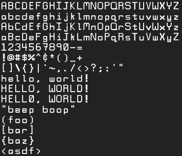
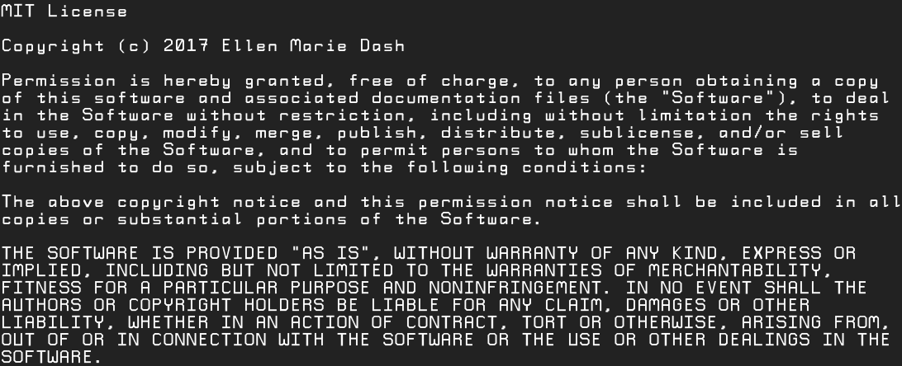

# awoof

A monospace font, but I'm furry trash so of course I named it awoof.

If you like awoof, consider supporting me via
[Liberapay](https://liberapay.com/duckinator/) or
[PayPal](https://www.paypal.me/duckinator)!

## Screenshots

## License

Awoof is available as open source under the terms of the [MIT License](http://opensource.org/licenses/MIT).

## Code of Conduct

Everyone interacting in the awoof project’s codebases, issue trackers, chat rooms and mailing lists is expected to follow the [code of conduct](https://github.com/duckinator/awoof/blob/master/CODE_OF_CONDUCT.md).
